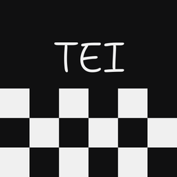

# teidraw

**A native infinite-canvas whiteboard with tldraw's feel.** One purpose, done
smoothly: think on a canvas with text, arrows, ink and media, at sub-frame
latency, with heuristics that guess what you meant.

<br clear="left">

https://github.com/user-attachments/assets/52881db0-0aff-48bb-91ca-2afc95dce8fe


## Download

Nightly builds, auto-published from `master`:

- **Windows (x64)** — [teidraw-windows-x64.zip](../../releases/latest/download/teidraw-windows-x64.zip) — single self-contained exe, the daily-driven build.
- **Linux (x64)** — [teidraw-linux-x64.tar.gz](../../releases/latest/download/teidraw-linux-x64.tar.gz) — ⚠️ **new and not battle-tested** (fresh SDL3 port); feedback via issues/PRs is very welcome. Single binary, static SDL3 + ffmpeg, X11/Wayland picked at runtime.

No installer: unzip and run. Boards and settings stay in plain folders you own.

## Why another whiteboard

[tldraw](https://tldraw.dev) nailed the UX of thinking on a canvas; teidraw
chases that exact feel in a native app — no browser, no electron, one binary
that opens instantly and stays at your display's refresh rate with a
3000-shape board loaded.

- **Latency is the feature.** On Windows: flip-model swapchain, frame-latency
  waitable, max latency 1 — input is sampled only once the swapchain can take
  a frame, so pointer-to-photon is as short as vsync allows, tear-free.
- **Text is crisp at every zoom.** Dear ImGui ≥1.92's dynamic font atlas
  rasterizes glyphs at the exact on-screen pixel size as you zoom.
- **Complexity is hidden.** The visible chrome is a five-tool toolbar, a
  style panel and a zoom pill. Everything else lives in the right-click menu.
- **Heuristics guess intent.** Click a group's child → the group; click again
  → drill to the child. Click selected text → edit it. Drop an arrow end on a
  shape → it binds, remembers the exact anchor, and trims itself at the
  target's bounds. Drop an image onto an image → replace its contents in
  place (a cropped frame keeps the frame). Draw fast → thinner ink.

## What's on the canvas

- **Text** — 4 families (Shantell Sans handwriting default, Inter, JetBrains
  Mono, Lora) × 4 sizes × continuous corner-resize; wrap-box side handles;
  in-house WYSIWYG editor (rotated/aligned/wrapped text edits exactly as
  rendered); auto bullet/numbered lists with hanging indent and renumbering.
- **Arrows** — curve with a mid-drag bend, shape bindings with exact anchors,
  auto-trim at target bounds, double-click labels that blank the line under
  them.
- **Freehand ink** — speed-thinned strokes tuned against tldraw's look, real
  pen pressure when a tablet reports it, shift chains straight segments into
  the same stroke; baked ink (move/scale/rotate, never reshaped).
- **Images / GIFs / videos** — drop or paste; GIFs autoplay; videos get a
  hover pill (play/stop/seek/A-B loop/sound), decode off-thread through
  ffmpeg, per-shape opt-in audio with the device clock driving A/V sync;
  ctrl+corner crop with a full-image ghost.
- **Groups** — real shapes with drill-in selection and persistent rotation.
- **Styling** — 12 theme-aware palette slots (boards restyle when the theme
  flips), S/M/L/XL sizes, alignment, opacity; dark/light.

Everything autosaves (400 ms debounce), and **undo history survives
restarts** (journaled snapshots per board).

## Controls

Scroll **always zooms at the cursor** — the one deliberate tldraw departure.
Pan with middle-drag, space+drag, right-*drag* (right-*click* = menu), or
**Alt+drag** (middle-mouse stand-in for laptops without one).

| | |
|---|---|
| `V` `H` `D` `T` `A` | select · hand · draw · text · arrow |
| double-click canvas | new text |
| `Ctrl+Z` / `Ctrl+Shift+Z` / `Ctrl+Y` | undo / redo |
| `Ctrl+C/X/V`, `Ctrl+D` | copy/cut/paste (shapes, PNGs, files, plain text), duplicate |
| `Ctrl+G` / `Ctrl+Shift+G`, `Ctrl+A`, `Del` | group / ungroup, select all, delete |
| `[` `]` | send backward / bring forward |
| `Shift+1` / `Shift+2` / `Shift+0` | zoom to fit / to selection / to 100% |
| corner drag · ring just outside a corner | scale · rotate (`Shift` = 15° steps) |
| `Ctrl`+corner on an image | crop |
| hold `Ctrl` while moving | snap to other shapes' edges/centers |
| arrows / `Shift`+arrows | nudge 1 px / 10 px |
| selected video: `Space` · `A`/`B` · `←`/`→` (`Shift` = 5 s) · `,`/`.` · `M` | play/pause · set loop points · seek · one frame · sound (flash pill feedback) |
| `Ctrl+Shift+C` | copy board/selection as PNG (2×) |
| `Ctrl+O` boards · `Ctrl+Shift+D` theme · `Esc` | picker · dark/light · pop drill/deselect |

## Boards are folders

A board is a directory: `board.json` (the document), `assets/` (every
imported file is *copied in* — boards are self-contained and portable), and
`undo.jsonl` (the cross-session undo journal). Settings (theme, recents,
boards home) live in `%APPDATA%\teidraw\settings.json` on Windows,
`~/.config/teidraw/settings.json` on Linux.

Only one teidraw instance can open a board at a time. A second opener stays
out of the board and asks you to close the first instance, preventing two
autosave/undo streams from racing. The small `.teidraw.lock` file may remain
in the folder; it is the live OS lock—not the file's presence—that matters,
so crashes do not leave a board permanently locked.

Made for feeding boards to LLMs, too:

```sh
teidraw <boardDir> --export out.png       # render board bounds → PNG
teidraw <boardDir> --export-txt out.txt   # reading-order text outline
```

…or `Ctrl+Shift+C` / right-click → *copy as PNG / copy as text* straight to
the clipboard.

## Building from source

Everything comes from the nix flake (mingw cross-toolchain, pinned imgui,
static cross ffmpeg, SDL3):

```sh
nix develop --command make -C editor          # → build/teidraw.exe (Windows)
nix develop --command make -C editor linux    # → build/teidraw (Linux, SDL3)
```

The Windows exe is cross-compiled from Linux/WSL2 and runs on the host via
WSLInterop. Without nix, `make linux` needs SDL3, ffmpeg (libav* dev),
imgui ≥1.92 (`IMGUI=`), stb (`STBI=`) and nlohmann json (`JSON_INC=`) — see
[.github/workflows/nightly.yml](.github/workflows/nightly.yml) for a complete
non-nix recipe.

Dev verification is screenshot-driven: `teidraw <board> --shot out.png`
renders headless (on Linux truly headless via SDL's offscreen driver).

## More

- design & rationale: [docs/ARCHITECTURE.md](docs/ARCHITECTURE.md)
- current state: [docs/STATUS.md](docs/STATUS.md) · plan: [docs/ROADMAP.md](docs/ROADMAP.md)
- deliberately **not** planned: multiplayer, rich text, every-tldraw-feature.

MIT licensed. Fonts vendored under the SIL OFL (see `assets/fonts/`).
